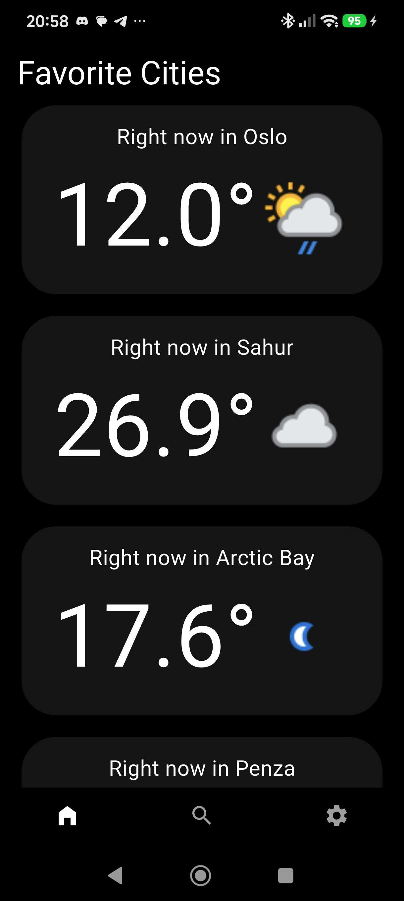
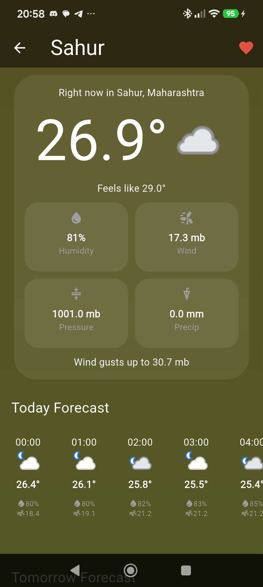
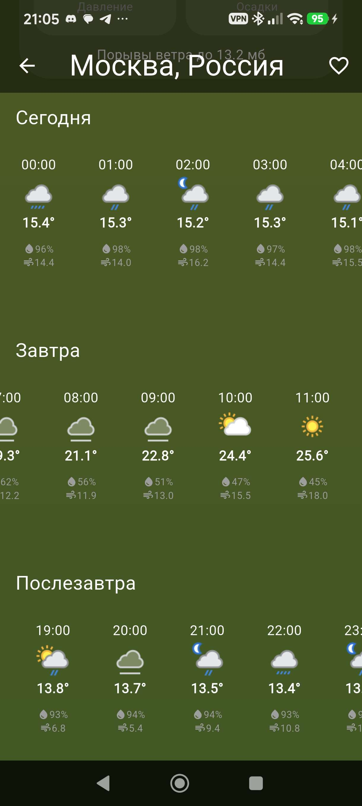

# 🌤️ Weather App

[](https://flutter.dev)
[](https://dart.dev)
[](https://www.weatherapi.com/)

Красивое и функциональное мобильное приложение погоды на Flutter с поддержкой мультиязычности, автокомплитом городов и сохранением избранного.

---

## 📱 Скриншоты

<p align="center">
  
  &nbsp;
  
  &nbsp;
  
  &nbsp;
  
</p>

---

## ✨ Основные возможности

* **🔍 Умный поиск с автокомплитом:** Поиск городов на лету с подсказками через API-запросы к `WeatherAPI`.
* **📅 Детальный прогноз на 3 дня:** Почасовая детализация температуры, влажности, скорости и направления ветра, давления и осадков.
* **⭐ Избранные города:** Быстрый доступ к сохраненным локациям на главном экране с локальным сохранением состояния через `SharedPreferences`.
* **🌐 Мультиязычность (l10n):** Полная поддержка смены языков интерфейса.
* **🎨 Кастомный UI:** Продуманный адаптивный дизайн с аккуратной презентацией данных.

---

## 🛠️ Технологический стек

* **Framework:** Flutter
* **Language:** Dart
* **API:** [WeatherAPI](https://www.weatherapi.com/)
* **Local Storage:** `shared_preferences`
* **Localization:** `flutter_localizations` (`l10n`)
* **Networking:** HTTP / REST API

---

## 🚀 Быстрый запуск

1. **Клонируйте репозиторий:**
   ```bash
   git clone [https://github.com/твой_ник/weather_app.git](https://github.com/твой_ник/weather_app.git)
   cd weather_app
